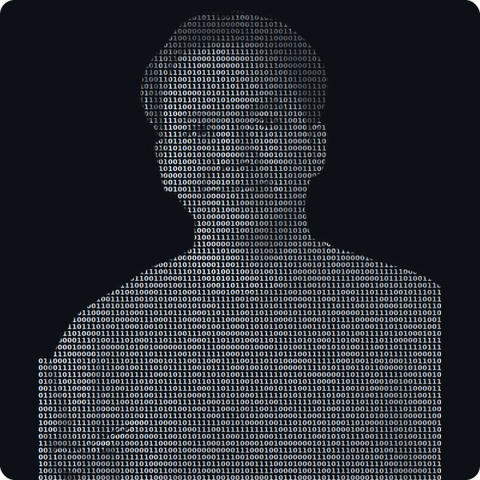

<h1 align="center">Hi there 👋 I'm Kawin</h1>
<p align="center">Applied Engineer · Software Engineer · Robotics · Neuroscience Data</p>

<p align="center">
  <a href="https://linkedin.com/in/kawin-yamtuan"></a>
  <a href="https://portfolio-nu-lake-84.vercel.app"></a>
  <a href="mailto:kawinyamtuan14@gmail.com"></a>
</p>

<table>
<tr>
<td width="42%" valign="top">
  
</td>
<td width="58%" valign="top">

```
kawin@github
--------------------------------------------------
Role...........: Applied Engineer / Software Engineer
Host...........: KMUTT - Institute of Field Robotics
Location.......: Nonthaburi, Thailand
Status.........: Open to Software Engineer roles

Education......: M.Eng Robotics & Automation (KMUTT)
                 B.Eng Mechanical (Thammasat, 1st Class, GPAX 3.59)

Languages.Prog.: Python, TypeScript, C++, R
Languages.Real.: Thai (native), English
AI / ML........: PyTorch, Deep Learning, Transformers, Computer Vision
Web............: Next.js, React, Node.js, Tailwind CSS, REST APIs
Robotics.......: ROS2, MuJoCo, PyBullet, OpenCV, MQTT, 6-DOF Arm
Signal.Proc....: EEG Preprocessing, Eye-tracking, Multimodal Analysis
Data...........: NumPy, Pandas, scikit-learn, SciPy
Tools..........: Git, Postman, SQLite, ANSYS

Projects.......: EEG Hyperscanning - Social Decision (MSc Thesis)
                 Delta Robot + YOLOv5 Visual Servoing (BSc)
                 6-DOF Robotic Arm ROS2 Control
                 Real-time SSVEP BCI Classification
                 BOROT - Robotics & AI Learning Platform

Publications...: JRC 2023 - Delta Robot Visual Servo (YOLOv5)
                 Brain Informatics 2025 - Multi-site Hyperscanning
Certs..........: HCCDA-AI (Huawei) . Gemini Certified Educator

Contact........: kawinyamtuan14@gmail.com
LinkedIn.......: linkedin.com/in/kawin-yamtuan
Portfolio......: portfolio-nu-lake-84.vercel.app
```

</td>
</tr>
</table>

---

### 📊 GitHub Stats

<p align="center">
  
  
</p>

<p align="center">
  
</p>
